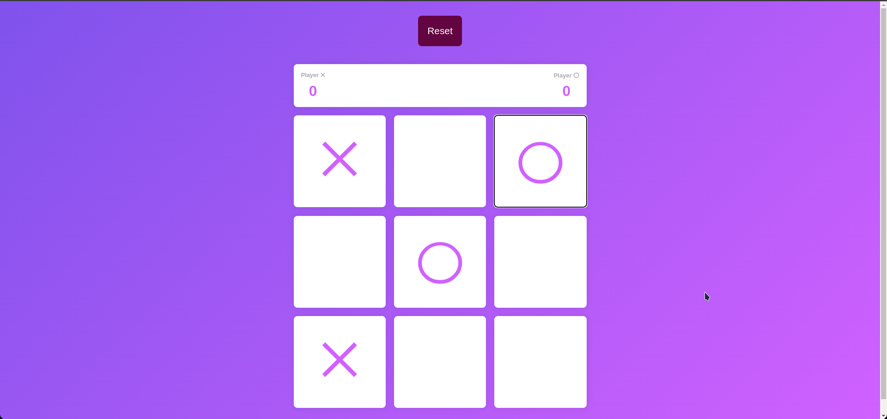
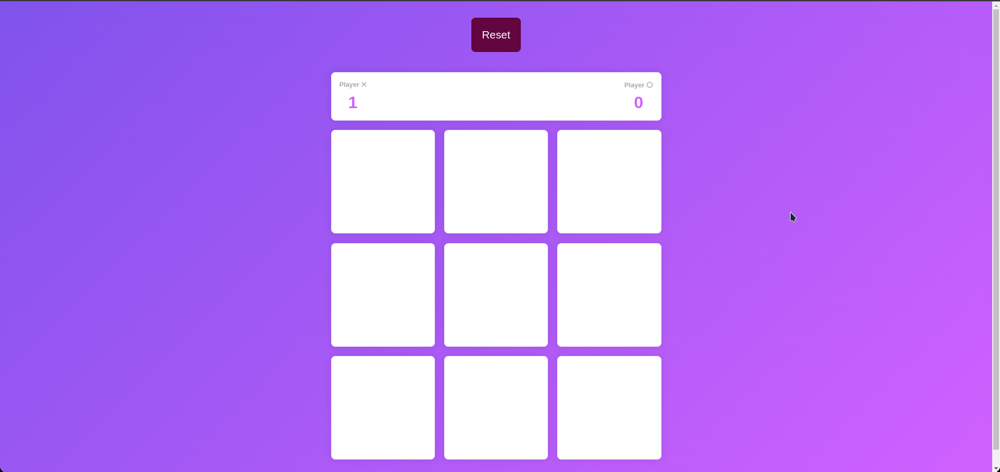

# Tic Tac Toe

## Description

This is a simple Tic Tac Toe game written in React. It is a two player game, where the players take turns to mark the spaces in a 3x3 grid. The player who succeeds in placing three of their marks in a horizontal, vertical, or diagonal row wins the game.

## How to play

1. Clone the repository
2. Run `npm install` to install the dependencies
3. Run `npm start` to start the application
4. Open [http://localhost:3000](http://localhost:3000) to view it in the browser

## Demo

## Screenshots

